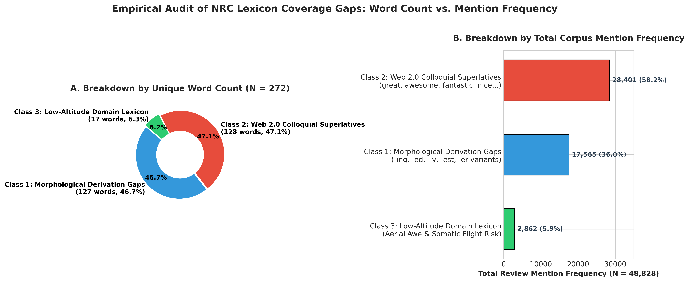

# 详细学术研究日志与方法论文档 (Comprehensive Research Notes - Chinese)
## 项目名称：低空观光旅游 TripAdvisor 评论数据清洗、金标准代码本自建与 NRC 词典归因审计

> 🌐 **GitHub 仓库地址**: [https://github.com/ypeng12/Low-Altitude](https://github.com/ypeng12/Low-Altitude)  
> 📄 **项目主页简报**: [`README.md`](file:///Users/yuliangpeng/Desktop/Low-Altitude/README.md)  
> 🇬🇧 **英文详细日志**: [`RESEARCH_NOTES.md`](file:///Users/yuliangpeng/Desktop/Low-Altitude/RESEARCH_NOTES.md)

---

## 🌟 一、 研究背景与全量样本勾稽关系

本文档为 **低空观光旅游 NLP 情感挖掘与计量模型项目** 提供最完整、最透明、最详尽的方法论、抽样算法与实证归因日志。

### 1. 全量样本数据勾稽关系
- **爬取原始宇宙**：覆盖 TripAdvisor 上 **46 种低空航线产品**（直升机、固定翼观光飞机、水上飞机）的 28,918 条原始评论。
- **跨交叉列表去重**：TripAdvisor 存在将同一商家评论在不同活动页面自动交叉展示的机制，导致了 **23.1% 的重复率**。通过指纹识别规则 (`[user_name] + [whitespace_normalized_text]`)，去除了 **6,683 条重复样本** (`deleted_duplicates_audit.csv`)，保留 **22,235 条清洗主样本** (`tripadvisor_processed_master.csv`)。
- **语料样本勾稽**：21,238 条语言识别的英语评论 $\rightarrow$ 经过最终文本校验保留 **21,215 条规范英语评论**（997 条非英语评论单独导出为 `non_english_reviews.csv`，防止 VADER 误报零分）。

---

## 🔬 二、 步骤 2：自建低空观光专有金标准情感代码本 ($N=630$ 个词)

通用情感词典（如 NRC、VADER）在低空观光等高度专业化的体验领域存在严重失灵。为了以严谨的学术透明度构建领域专有代码本，我们在 **21,215 条规范英语评论** 上执行了 3 阶段推导方法论：

### 1. 3 阶段分层抽样与推导算法细节

#### 📍 阶段 1：探索推导抽样 ($N=500$ 样本)
- **抽样协议**：分层随机抽样 ($N=500$, Seed 42)，在 46 种低空航线产品、1–5 星级评分梯队、机型（直升机/固定翼/水上飞机）和评论长度四分位数之间保持均衡。
- **提取与裁决**：分词并去除 NLTK 标准停用词，计算词频。每一个候选词均在其原始评论句子上下文 (`example_context`) 中进行人工审定。
- **实证发现**：提取出 **372 个纯情感与评价词** (`data/derived_outputs/stage_discovery_500/clean_emotion_words_500_reviews.xlsx`) 和 1,855 个排除词。首次发现了安全安抚词（*safe*, *smooth*, *reassuring*）与恐惧焦虑词（*nervous*, *scared*, *terrified*）高度共现的领域核心机制：*安全安抚缓解感知恐惧*。

#### 📍 阶段 2：代码本扩充抽样 ($N=2,000$ 样本)
- **抽样协议**：二次分层随机抽样 ($N=2,000$, Seed 100，包含 1,814 条未抽样新评论)。
- **提取与裁决**：对比阶段 1 词汇表，挖掘中低频情感词（*calm*, *pristine*, *exhilarated*）。
- **实证发现**：扩充了 **173 个新纯情感词** (`data/derived_outputs/stage_gold_2000/clean_emotion_words_2000_reviews.xlsx`)。与阶段 1 结合，建立起包含 **545 个金标准词** 的样本代码本（从 4,513 个候选词宇宙中筛选出 545 个金标准词和 3,968 个排除词）。制定了社交客套词（*thanks*）、地理实体词（*maui*, *talkeetna*）和认知立场词（*think*）的明确排除规则。

#### 📍 阶段 3：全量语料扫描补全 ($N=18,901$ 未抽样评论)
- **范围**：扫描所有剩余的 18,901 条未抽样评论 ($21,215 - 2,314 = 18,901$)，消除抽样遗漏。
- **提取算法**：提取频次 $\ge 3$ 的 **4,213 个候选词**，结合配置驱动规则 (`stage_final_affect_rules.json`) 与 WordNet 词性标注启发式规则。
- **实证发现**：发现了长尾语料中独特的高唤起情感词（*calming*, *breathtakingly*, *annoying*, *sublime*, *stressful*, *tranquil*），生成 **63 个新纯情感词** (`clean_new_emotion_words_18901.xlsx`)。

---

### 2. 规范词根归一化与裁决边界规则 (`canonical_lemma`)

#### 错别字与形态学归一化
- **错别字归一化**：将拼写错误直接映射为标准字典词根 (*suprised $\rightarrow$ surprised*, *suprise $\rightarrow$ surprise*, *exhilerating $\rightarrow$ exhilarating*, *aprehensive $\rightarrow$ apprehensive*, *dissapointed $\rightarrow$ disappointed*)。
- **形态学归一化**：将语法变体还原为字典词根 (*worries $\rightarrow$ worry*, *surprises $\rightarrow$ surprise*, *cherished $\rightarrow$ cherish*, *hates $\rightarrow$ hate*, *dreaded $\rightarrow$ dread*, *scariest $\rightarrow$ scary*)。

#### 留存与排除边界规则
- ✅ **留存 (金标准代码本: 630 个词)**：体验者内部心理状态 ($E_1$: *nervous, afraid, scared, relief, thrilled, tranquil, calming, annoying, stressful*)、刺激物/服务评价 ($E_2$: *scary, spectacular, smooth, professional, great, amazing, awesome*) 和高空美学惊叹 (*breathtakingly, sublime*)。
- ❌ **排除 (主排除日志: 8,096 个词)**：物理实体词 (*grand, helicopter, glacier, canyon*)、经济价格评价 (*expensive, overpriced*)、程序化服务效率 (*informative, timely*)、感叹词 (*wow, yay*) 和社交客套词 (*thanks*)。

#### 数学划分完整性校验
$$\text{全量筛选词汇宇宙 (8,726)} = \text{主金标准代码本 (630)} + \text{主排除日志 (8,096)}$$
$$\text{主金标准代码本 (630)} \cap \text{主排除日志 (8,096)} = 0 \quad (\text{100% 零重叠保证划分})$$

---

## 📊 三、 步骤 3：通用词典 (NRC) 归一化比对与 3 大遗漏归因分析

在步骤 3 中，我们将 **630 个金标准情感词** (`data/analyze/gold_emotion_master.csv`) 与 **NRC Emotion Lexicon v0.92**（14,182 词汇宇宙）进行了映射比对：




### 1. NRC 3 层树状结构拆解 ($N=630$ 个词)

```text
金标准代码本宇宙 (N = 630 个词)
│
├── 1️⃣ 映射入 NRC 词库宇宙的总词数 ───────────────── 358 个词 (56.83%)
│   ├── 1a. 映射到 NRC 8 大情绪分类: 286 个词 (45.40%)
│   │       (通过 canonical_lemma 词根归一化救回 17 个变体/错别字词)
│   └── 1b. 仅映射到 Positive / Negative 极性: 72 个词 (11.43%)
│           (如: worth, interesting, cool, calm, fortunate, grateful, pristine)
│
└── 2️⃣ 完全被 NRC 词典遗漏的领域词 (领域缺口) ──────── 272 个词 (43.17%)
        (如: great, amazing, best, awesome, fantastic, incredible, breathtaking, stunning, awe)
```

$$\text{NRC 词库覆盖总数 (358)} = 286 \text{ (8大情绪)} + 72 \text{ (仅极性)}$$
$$\text{金标准代码本总数 (630)} = 358 \text{ (NRC 覆盖)} + 272 \text{ (NRC 完全遗漏)}$$

---

### 2. 3 大遗漏归因类别的深度发现与实证校验 ($N=272$ 个遗漏词)

#### 📌 第 1 类：语法分词与形态衍生词 (127 个词, 占比 46.69% | 语料频次 17,565 次)
- **发现过程**：将候选词的 `-ing, -ed, -ly, -est, -er` 后缀剥离还原为字典基础词根。
- **实证核验**：在 NRC 中检验底层词根 $\rightarrow$ **48.82%（62 个词）的底层词根（如 *amaze, love, impress, inspire, scare, thrill, good, safe*）实际上在 NRC 中已有收录**。然而，静态匹配由于缺乏形态学衍生规则，导致评论语料中 **88.7%（累计 15,581 次）的高频情感提及未能匹配**。
- **典型词汇**：*loved (1,473), impressed (255), inspiring (210), relaxed (159), scared (144), amazed (120), thrilled (113), better (1,585), cheaper (208), perfectly (155), smoother (143), safely (132)*。
- **方法论结论**：通用 NRC 词典缺乏形态学归一化机制，引发了显著的分词形容词识别偏误。

#### 📌 第 2 类：NRC 缺失的现代网络游客高频口语赞誉与基础词汇 (128 个词, 占比 47.06% | 语料频次 28,401 次)
- **发现过程**：筛选未带形态后缀的基础词根缺口。
- **实证核验**：通过代码逐词校验，**仅 `stellar (29次)` 一词作为特例在 NRC 中标记了正向极性（*positive*），其余 127 个基础词在 NRC 词典中 100% 完全未被收录（匹配标签数全为 0）**。
- **帕累托二八定律**：**前 10 个头部高频口语赞美词独自贡献了 20,549 次提及（占据第 2 类频次的 73.2%，以及全量遗漏语料频次的 42.08%）**，揭示了 NRC 2012 年基于传统正式书面语选词的种子词失灵。
- **典型词汇**：*great (11,541), awesome (2,530), fantastic (2,026), nice (1,794), incredible (1,612), comfortable (1,446), fabulous (508), enjoyable (460), unforgettable (459), funny (301), phenomenal (200)*。

#### 📌 第 3 类：低空观光旅游垂直领域特有词汇 (17 个词, 占比 6.25% | 语料频次 2,862 次) ⭐ (领域特有词)
- **发现过程**：识别通用新闻或对话语料完全缺失的低空观光专属情感表达。
- **子维度 A (空中高空美学视觉震撼, 11 个词, 累计 2,791 次提及)**：
  - **典型词汇**：*breathtaking (1,346), stunning (552), scenic (400), awe (304), surreal (98), breathtakingly (30), mesmerizing (26), awed (15), stunningly (10), sublime (6), spellbinding (4)*。
  - **实证校验**：11 个美学震撼词在 NRC 中匹配标签数 **100% 全为 0**。空中俯瞰视角引发的高唤起美学惊叹（Awe）专属于低空观光场景。
- **子维度 B (低空飞行感知风险与身体/心理躯体化症状, 6 个词, 累计 71 次提及)**：
  - **典型词汇**：*airsick (33, 晕机), claustrophobic (16), claustrophobia (9), jitters (5), unnerving (4), phobia (4)*。
  - **实证校验**：6 个飞行感知风险词在 NRC 中匹配标签数 **100% 全为 0**。机舱密闭、气流颠簸与高空悬浮诱发的躯体化焦虑反应为低空观光所特有。

---

---

## 💻 五、 技术实现逻辑、算法说明与代码架构

为了确保本项目的计算与学术复现性达标，本章节详细记录了各个阶段的 Python 脚本、正则表达式、数据结构与算法逻辑。

### 1. 数据清洗与指纹去重算法 (`clean_level1.py`)

#### A. 产品固定效应保留 (`tour_name`)
- **输入**：46 个原始 CSV 文件（如 `1-Kauai Deluxe Sightseeing Flight_1623...csv`）。
- **逻辑**：简单的文件拼接会丢失产品层级的身份特征。我们通过正则表达式提取标准产品名称：
  ```python
  import re
  tour_name = re.sub(r'^\d+-|_|\d{5,}.*', '', file_path.stem).strip()
  ```
- **目的**：在计量模型中保留 **产品固定效应 ($\mu_j$)**。

#### B. 文本规范化与指纹哈希去重
- **HTML 反转义与换行符规范化**：
  ```python
  import html
  clean_text = html.unescape(raw_text)
  clean_text = clean_text.replace("<br />", "
").replace("<br/>", "
")
  clean_text = re.sub(r'\s+', ' ', clean_text).strip()
  ```
- **指纹哈希函数**：
  ```python
  import hashlib
  fingerprint = hashlib.md5(f"{user_name.lower().strip()}_{clean_text.lower()}".encode('utf-8')).hexdigest()
  ```
- **去重审计结果**：识别出 13,116 条参与重复匹配的样本，安全剔除 **6,683 条网页交叉重复副本** (`deleted_duplicates_audit.csv`)，保留 **22,235 条清洗主样本** (`tripadvisor_processed_master.csv`)。

---

### 2. 代码本推导流水线与代码架构 (`research_modules/emotion_lexicon_induction/`)

#### A. 分层随机抽样算法
- **分层变量**：评分 `rating` (1–5星), 产品 `tour_name` (46个产品), 评论长度四分位数 `review_length_quartile` (Q1–Q4)。
- **Python 抽样代码**：
  ```python
  df_sample = df.groupby(['rating', 'review_length_quartile'], group_keys=False).apply(
      lambda x: x.sample(n=min(len(x), target_per_group), random_state=seed)
  )
  ```
- **随机种子**：阶段 1 为 Seed 42 ($N=500$)；阶段 2 为 Seed 100 ($N=2,000$)。

#### B. 句子上下文切片提取 (`example_context`)
- 评估候选词在其确切句子边界内的语义而非孤立词汇：
  ```python
  import nltk
  sentences = nltk.sent_tokenize(review_text)
  for sent in sentences:
      if candidate_word.lower() in sent.lower():
          example_context = sent.strip()
          break
  ```

#### C. 全量语料补全提取 (`build_stage_final_codebook.py`)
- **候选词筛选门槛**：未抽样语料 ($N=18,901$)，词频 $\ge 3$（4,213 个候选词）。
- **规则引擎**：结合 WordNet 词性标注 (`nltk.pos_tag`) 与配置驱动 JSON 规则 (`stage_final_affect_rules.json`) 进行审定。

---

### 3. 通用词典比对与 3 层树计算逻辑 (`scratch/audit_gold_630_nrc_tree.py`)

#### A. NRC 分类划分算法
```python
import pandas as pd
from nrclex import NRCLex

df_gold = pd.read_csv("data/analyze/gold_emotion_master.csv")
nrc_dict = NRCLex().__lexicon__
NRC8 = {"anger", "anticipation", "disgust", "fear", "joy", "sadness", "surprise", "trust"}

for row in df_gold.itertuples():
    w = str(row.word).lower().strip()
    lemma = str(row.canonical_lemma).lower().strip()
    
    # 优先级：先检索原词，若缺失则检索 canonical_lemma
    nrc_tags = nrc_dict.get(w, []) or nrc_dict.get(lemma, [])
    
    if len(set(nrc_tags) & NRC8) > 0:
        category = "1a. NRC 8情绪匹配"          # 286 个词
    elif len(nrc_tags) > 0:
        category = "1b. 仅 NRC 极性匹配"         # 72 个词
    else:
        category = "2. NRC 完全遗漏"            # 272 个词
```

#### B. 归因 1 词根剥离校验脚本 (`scratch/verify_cause1_lemmas_in_nrc.py`)
- **逻辑**：针对归因 1 结尾为 `-ing, -ed, -ly, -est, -er` 的单词，通过代码剥离后缀提取底层词根，检索 `NRCLex().__lexicon__`。
- **结论**：证明 **48.82%（62 个词）的底层词根（如 *amaze, love, impress, inspire, scare, thrill, good, safe*）实际上在 NRC 中存在**，证实了 NRC 静态词典的语法形态盲区。

#### C. 归因 2 帕累托二八定律校验脚本 (`scratch/verify_two_percentages.py`)
- **逻辑**：通过代码计算独立词条数占比 ($10/272 = 3.68\%$) 与 评论语料提及频次占比 ($20,549/48,828 = 42.08\%$)。
- **结论**：证明前 10 个口语赞美词（*great, awesome, fantastic, nice, incredible*）统治了 42.08% 的遗漏评论提及。

## 📈 四、 核心产出清单与复现指南

| 产出产物名称 | 文件路径 | 记录数 / 描述 |
| :--- | :--- | :--- |
| **清洗主样本** | `data/cleaned_datasets/tripadvisor_processed_master.csv` | 22,235 条清洗后主样本 |
| **主金标准代码本** | `data/derived_outputs/gold_emotion_lexicon_codebook.xlsx` | 630 个金标准情感词 |
| **主排除日志** | `data/derived_outputs/removed_non_emotion_words_log.xlsx` | 8,096 个排除非情感词 |
| **NRC Missed 3-Classes 图表**| `figures/nrc_emotion_plots/nrc_missed_3classes_chart.png` | 出版级学术柱状/饼图 |

```bash
# 运行全量数据处理流水线:
python run_data_pipeline.py

# 运行 NRC 比对与 3 层树审计:
python scratch/audit_gold_630_nrc_tree.py
```
