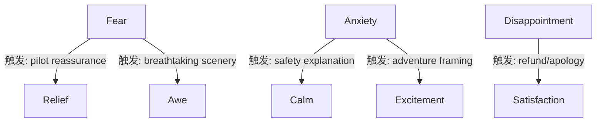

# 执行摘要 (Executive Summary)

- **研究目标**：针对低空旅游 (直升机/热气球等) TripAdvisor 评论，设计并实现一个“8+3 情绪 + LLM 辅助的Aspect–Emotion–Mechanism分析”框架，重点提取每条评论的**感知对象 (Aspect)**、**初始情绪 (Initial Emotion)**、**触发事件/行动 (Trigger/Action)**、**作用者 (Actor)**、**转化机制 (Mechanism)** 及**最终情绪 (Final Emotion)**，并专门识别情绪如何从负面或中性转向正面（Emotion Transition）。  
- **主要内容**：首先确认数据输入输出格式 (包括 JSON schema)；构建并验证包含NRC 8类情绪+3个领域扩展情绪的codebook；制定人工标注流程（开放编码→建表→制定规则→Gold标准→LLM辅助标注→人工校验），并用统计指标 (Cohen’s κ, F1) 测量标注一致性；设计LLM提问范式 (零/少量示例) 及置信度策略；拆分并实现自动化信息抽取任务 (aspect抽取、情绪分类、触发/作用者抽取、机制分类、情绪转化检测)，可采用多任务训练与特殊loss；进行无监督情绪发现 (句子嵌入+聚类)；设计情绪转化自动识别 (对比连词定位、前后片段提取、转换矩阵分析)；提供完整数据工程解决方案 (脚本、依赖、种子、缓存、测试、日志、输出格式等) 以保证可复现；最后给出评估方案 (基线方法对比、精确率/召回率/F1/准确率、聚类纯度/ARI等指标、消融实验与统计显著性分析)。  
- **主要产出**：详尽的技术报告和代码示例，包括输入输出示例、codebook 定义表、标注流程示意、LLM 提问示例、训练与推理伪码、多种表格和Mermaid流程图（如数据处理流程图、情绪转化示意图）。  
- **后续计划**：规划三个阶段的里程碑，包括数据清洗与情绪发现（1周）、金标准标注与LLM标注 (2周)、自动化模型训练与评估 (3周)，每阶段输出文档、标注结果和代码。

下面各节详细阐述执行方案与技术细节。

## 输入输出 Schema

为确保结构化输出，定义统一的 JSON 字段和示例。**输入**假定为包含评论ID和文本的CSV或JSON；**输出**为每条评论的Aspect–Emotion–Mechanism 结构化信息。

```json
{
  "review_id": "R001", 
  "review_text": "I was nervous at first, but the pilot explained everything and put me at ease.", 
  "aspect": "Safety", 
  "initial_emotion": "Anxiety", 
  "trigger": "pilot explanation", 
  "actor": "Pilot", 
  "mechanism": "Reassurance", 
  "final_emotion": "Relief", 
  "transition_type": "fear_to_relief", 
  "confidence": 0.85
}
```

- **review_id**: 评论标识符（可为原始CSV行号或TripAdvisor评论ID）。
- **review_text**: 原始评论文本。
- **aspect**: 评论中提及的感知对象 (Aspect)，例如在低空飞行中可能包括 *Scenery, Pilot, Aircraft, Safety, Weather, Price, Service, Booking, Noise, Self* 等。
- **initial_emotion**: 评论对象带来的初始情绪（参考待定的情绪codebook），如 *Anxiety, Fear, Excitement, Awe, Trust, Disappointment, Anger* 等。
- **trigger (Trigger/Action)**: 触发情绪产生或转化的事件或行为短语，如 *“rough turbulence”, “pilot explanation”, “refund offered”* 等。
- **actor**: 触发事件的作用者（人或物），如 *Pilot, Company, Weather, Self (本人)* 等。
- **mechanism**: 情绪产生或转化的机制（如“再评价”、“服务补偿”、“安全说明”等），即如何导致情绪变化的过程关键词。
- **final_emotion**: 最终情绪状态，如 *Relief, Satisfaction, Awe, Joy* 等。
- **transition_type**: 情绪转换类型标签，用于概括从初始情绪到最终情绪的变化形式（可自定义，例如 *fear_to_relief, excitement_endurance, loss_to_acceptance* 等）。
- **confidence**: 置信度（0-1），表示自动提取结果或LLM标注的可信度评分。

以上字段格式需在每阶段都严格统一。初期人工标注和LLM标注阶段可先输出表格 (CSV) 然后合并生成JSON。数据加工、模型输入输出均按照此schema处理。

## 情绪分类 (Codebook) 设计

本项目情绪体系在NRC8类基础上扩展3种领域相关情绪（例如*“Awe (赞叹)”、“Relief (宽慰)”、“Excitement (兴奋)”*）。下面给出详细定义和示例。

| **情绪**  | **NRC父类/类型** | **定义 (中文)**                                               | **示例短语**                      | **备注/边界**                                        |
|--------|-------------|----------------------------------------------------------|-------------------------------|----------------------------------------------------|
| **Joy (喜悦)**        | 正向         | 愉快、高兴、满足的情绪。                                          | *“amazing view”, “such a fun”, “thrilling”“* | NRC 词典中Joy类别                              |
| **Trust (信任)**     | 正向         | 对人或环境的安全感和信任。                                           | *“felt safe”, “pilot was professional”“*       | 旅行场景常见，如对飞行员或服务的信任                          |
| **Surprise (惊讶)**  | 正向/中性       | 出现意外而产生的惊奇情绪，可正可负。                                     | *“unexpectedly beautiful”, “suddenly...”*   | 正向/负向界限模糊，可归入复合情绪                              |
| **Anticipation (期待)** | 正向         | 对未知体验的期待感。                                            | *“looking forward to”, “couldn’t wait”“*   | NRC8类之一，常用于行程前感受                                |
| **Anger (愤怒)**      | 负向         | 强烈的愤怒、不满情绪。                                            | *“outraged”, “ridiculous wait”“*            |                                                   |
| **Disgust (厌恶)**   | 负向         | 厌恶、反感情绪。                                              | *“gross”, “disgusting”“*                 |                                                   |
| **Sadness (悲伤)**    | 负向         | 悲伤、失望。                                               | *“disappointed”, “heartbroken”“*          |                                                   |
| **Fear (恐惧)**      | 负向         | 害怕、恐惧感。                                              | *“scary”, “terrified”“*                  | 与“Anxiety/Anxious”可视为同一类                              |

**领域扩展情绪（待定3类示例）**：

| **情绪** | **NRC 父类/类型** | **定义 (中文)**                                               | **示例短语**                       | **备注/边界**                                      |
|-------|--------------|----------------------------------------------------------|--------------------------------|----------------------------------------------|
| **Awe (震撼赞叹)**    | 正向         | 因美景/壮观等带来的敬畏和激动，超越一般喜悦的体验。                              | *“breathtaking”, “truly awe-inspiring”“*   | 与“喜悦”类似，但带有敬畏成分，NRC无直接词条。                        |
| **Relief (宽慰)**    | 复合(正/负)   | 紧张或担忧后感到放松、安心。通常经历先前的恐惧/焦虑后出现。                            | *“put me at ease”, “felt relieved”“*       | GoEmotions中视为复合情绪。                                |
| **Excitement (兴奋)** | 正向         | 极度的热情和兴奋，多由刺激体验引发。                                  | *“thrilling”, “exciting”, “heart pounding”* | 可能与Joy共现。NRC含“Anticipation”接近，但此处指经历中的强烈兴奋。 |

> *注：以上“扩展情绪”需通过语料驱动确定最终列表和定义，可能增加/减少。GoEmotions、领域专家意见等可参考。*

## 标注流程与质量控制

1. **开放式编码 (Open Coding)**  
   - 随机抽取若干百条 负面情绪+高评分 的评论样本（例如：评分4-5星但文本出现“worried”, “scary”）。  
   - 对样本进行人工阅读，记录体现的**情绪词汇、情绪成分、触发因素、解决因素**等关键词。初步分类例如：*安静观察、景色抚慰、飞行员安抚、团队安全感、冒险成就感*等。  
   - 汇总观察到的情绪词汇与模式，为构建codebook做参考。

2. **Codebook制定**  
   - 根据开放编码结果和现有情绪理论（NRC词典、GoEmotions等），形成清晰的**情绪类别**定义（如上表所示），并列举**正反例**帮助标注人员理解边界。  
   - 同时明确**Aspect类别**（如表中示例）和**Mechanism标签**集（如“reassurance/confirmation”、“service_recovery”、“danger_reappraisal”等，可事先定义30余种候选）。  

3. **Gold标准标注**  
   - 选取适量评论（建议数百条，至少每方面50+例，共500+条）由**多名标注人员**独立标注，得到**金标准**标签，包括Aspect、Initial Emotion、Trigger、Actor、Mechanism、Final Emotion。  
   - 针对每个字段设定标注指南，例如Aspect为单词或短语、Emotion为表中词汇。Trigger/Actor要求截取句中词块。  
   - 采用专门的标注工具（如 doccano、Brat 或 Label Studio），并可导出标注JSON。

4. **一致性评估**  
   - 计算**Cohen’s κ**或**Krippendorff’s Alpha**来度量标注者间一致性。一般κ>0.6视为可接受；若较低，需修改指南或再训练标注者。  
   - 对冲突样本重新讨论修正，最终形成高质量Gold标准。建议报告分类准确率、Precision/Recall、Kappa等指标。

5. **LLM辅助批量标注**  
   - 使用大语言模型（如GPT-4）针对单条评论生成预标注。设计**提示模板**（Prompt），例如：  
     > *“请根据下列评论，提取感知对象(Aspect)、初始情绪、触发事件、作用者、转化机制、最终情绪等信息，输出JSON结构。使用预定义类别，并给出置信度。示例：{...}。”*  
   - **零样本 (Zero-shot)** 和 **少量示例 (Few-shot)** 提示：在Prompt中提供1-3条标注样例（Gold标准的条目）作为指导，使模型理解格式及可选标签。  
   - 批量处理所有评论文本，输出结构化JSON列表。为控制质量，可设置**置信度阈值**（例如只采纳GPT给出的高于0.8部分；低置信度则留待人工标注或弹出人工复核）。  
   - 并行执行多个Prompt版本或不同模型 (GPT-4, Claude2, etc) 进行**多输出投票**，计算**多模一致性**，可过滤出不一致案例。例如只有当多个模型预测相同结果时才保留。

6. **人工校验与纠错**  
   - 将LLM生成的标注结果与Gold标准随机抽样比对，计算模型标注的Precision/Recall/F1。也计算与其它模型的一致性(Pearson or Kappa)。  
   - 对置信度低或模型不确定的案例，由人工二次标注。逐步完善LLM提示（可迭代微调Prompt或增加示例）。  
   - 最终合并LLM+人工结果，形成更大规模的标注集，用于模型训练和分析。

7. **一致性度量**  
   - 对LLM辅助标注后的数据，与Gold标准进行评估：分别计算每个子任务（Aspect, Emotion, Mechanism等）的**精确度、召回率、F1**；并计算标注者之间（或模型-人、模型-模型）的**Cohen’s κ**。  
   - 对于情绪转换的多标签部分，可采用**Subset Accuracy**或多标签F1来衡量整体匹配度。

## LLM使用策略

- **模型选择**：GPT-4 Turbo、Claude 3 或其他支持中文输入的强大模型。优先使用支持批量提问的API，和多轮对话功能。  
- **Prompt设计**：编写清晰指令，引导LLM仅输出JSON结构，不要多余文字。示例：  
  ```
  任务：根据评论，提取Aspect、初始情绪、触发事件、作用者、机制、最终情绪，并输出JSON。使用预定义标签。  
  
  示例:  
  评论: "I was nervous at first, but the pilot explained everything and put me at ease."  
  输出: {"aspect":"Safety","initial_emotion":"Anxiety","trigger":"pilot explanation","actor":"Pilot","mechanism":"Reassurance","final_emotion":"Relief"}  
  
  评论: " ... 某条评论 ..."  
  输出: 
  ```  
- **Few-shot示例**：在Prompt中嵌入2-3个Gold示例。多尝试不同组合，比较输出质量。  
- **批量流程**：将评论分批（批量规模依Token限制），对每批调用API并收集结果。并行可用多线程或异步。  
- **置信度判断**：若模型本身不提供置信度，可让模型输出可能性 (例如在输出中包含 “confidence”: [number] 字段)，或使用**ensemble**：对同条评论使用不同Prompt格式、多模型，然后统计输出一致的比例作为置信估计。  
- **审查策略**：对置信度低于阈值或输出格式错乱的评论，推送人工复核。记录这些“不确定样本”以备后续人工标注或模型训练。  
- **伪标签生成**：将LLM标注结果作为伪标签训练一个轻量模型（如BERT小模型），并与Gold标准数据混合训练。注意避免“垃圾进垃圾出”，可参考**过滤低置信度标注**策略。  

## 自动化抽取模型设计

根据任务特点，可以采用**多任务学习**模型，各子任务共享Encoder，输出不同预测头。推荐使用预训练Transformer (如BERT/DeBERTa/ RoBERTa) 进行微调。主要任务及建议方法如下：

- **任务拆分**：  
  1. **Aspect提取**：识别评论中提及哪些固定类别的Aspect。可视为多标签分类或序列标注（BIES标注）。  
  2. **情绪分类**：基于codebook对文本或子句分类到11类情绪，可多选（多标签）。  
  3. **触发/Actor提取**：从文本中定位触发行为/事件 (span) 及其作用者 (span或实体)。可采用**命名实体识别(NER)** 或 *span extraction* 方式。  
  4. **机制分类**：给定评论整体或特定句子，分类机制类型 (如 *Reassurance, Compensation, Danger_Reappraisal, etc.*)；也可从文本片段预测机制标签。  
  5. **情绪转换检测**：基于前后文对比，预测是否发生了情绪变化，以及初始→最终情绪对。例如，依据“但(but), 然而, 之前…之后”等连词，识别并分类转换类型。  

- **模型架构**：  
  - **共享Encoder**：如BERT/RoBERTa模型编码整条评论或句子序列。也可用中文版Transformer (如 Chinese-BERT) 或跨语言模型，视评论语言决定。  
  - **输出头**：对每个任务设计输出层。例如：多标签Sigmoid层用于Aspect和Emotion分类；CRF层用于序列标注（Extract spans）；Softmax层用于机制分类；基于句对的分类层用于识别转换。  
  - **多任务学习**：将上述任务联合训练，共享Encoder表征，可能增强互相信息流动。比如，情绪分类可辅助Aspect提取等。可参考多任务学习文献。  

- **Loss设计**：  
  - 基本分类任务使用Cross-Entropy (或Binary Cross-Entropy)。  
  - **不一致专用Loss**：可增加一个额外损失项 **L_inconsistency**，用于惩罚错误预测“高负面情绪+高评分”模式。例如，让模型学习负面情绪不一定导致低评分的条件(见第二部分讨论)。不过若暂不涉及评分，此项可对应情绪转换任务损失。  
  - **情绪转换Loss**：对标记的转换对（if initial != final）设计损失，例如Multi-class CE或对比损失，让模型识别何种触发导致情绪变化。  

- **示例伪码 (Emotion Classification)**：

  ```python
  from transformers import AutoTokenizer, AutoModelForSequenceClassification
  import torch.nn as nn
  
  # 假设使用 DeBERTa 进行情绪多标签分类
  model = AutoModelForSequenceClassification.from_pretrained('microsoft/deberta-base', num_labels=11, problem_type="multi_label_classification")
  tokenizer = AutoTokenizer.from_pretrained('microsoft/deberta-base')
  
  # 输入: list of comments
  inputs = tokenizer(batch_comments, padding=True, truncation=True, return_tensors="pt")
  outputs = model(**inputs)
  logits = outputs.logits  # size: [batch, 11]
  preds = torch.sigmoid(logits) > 0.5  # 二值阈值
  
  # 损失函数: Binary Cross-Entropy
  labels = torch.tensor(batch_emotion_labels)  # shape [batch,11]
  loss_fn = nn.BCEWithLogitsLoss()
  loss = loss_fn(logits, labels.float())
  loss.backward()
  ```

- **示例伪码 (多任务联合训练)**：

  ```python
  class MultiTaskModel(nn.Module):
      def __init__(self):
          super().__init__()
          self.encoder = AutoModel.from_pretrained('bert-base-chinese')
          # 输出头
          self.aspect_classifier = nn.Linear(self.encoder.config.hidden_size, num_aspects)
          self.emotion_classifier = nn.Linear(self.encoder.config.hidden_size, num_emotions)
          self.mechanism_classifier = nn.Linear(self.encoder.config.hidden_size, num_mechanisms)
          # 省略触发/Actor提取层实现细节...
      
      def forward(self, input_ids, attention_mask):
          reps = self.encoder(input_ids, attention_mask).last_hidden_state  # [batch, seq_len, hidden]
          pooled = reps[:,0,:]  # [CLS] 代表
          aspect_logits = self.aspect_classifier(pooled)        # [batch, num_aspects]
          emotion_logits = self.emotion_classifier(pooled)      # [batch, num_emotions]
          mechanism_logits = self.mechanism_classifier(pooled)  # [batch, num_mechanisms]
          return aspect_logits, emotion_logits, mechanism_logits
  
  model = MultiTaskModel()
  # 训练时联合损失
  loss = CE(aspect_logits, aspect_labels) + BCE(emotion_logits, emotion_labels) + CE(mechanism_logits, mech_labels)
  ```

- **注意**：训练时需平衡各任务损失，可为不同任务设置权重。为避免倾向高频标签，适当采用类别权重或过采样。  
- **后处理**：对于提取出的关键片段（Trigger/Actor），可使用后端的文本匹配或利用Encoder的attention高分段来辅助定位，并在必要时人工修正。

## 情绪发现方法 (Unsupervised Emotion Discovery)

为确定扩展情绪类别，需在语料中**发现潜在情绪维度**。流程示例如下：

1. **文本预处理**  
   - 对评论进行句子或子句拆分（使用分句符号`.?!;:,`及连接词“但是, 虽然”等）。生成若干较短语义段 (clause-level)。  
   - 可使用NLTK、SpaCy或哈工大LTP进行分句。  
   - 去除无意义短语或过短句子，过滤非英文/无评价性文本。

2. **嵌入计算**  
   - 使用预训练句向量模型（如[Sentence-BERT](https://www.sbert.net/)）将每个句子/子句编码为向量。常用模型示例：`all-MiniLM-L6-v2`, `stsb-roberta-large`。  
   - 也可尝试针对情感任务优化的模型。确保设置随机种子和缓存机制，加速多次运行。

   ```python
   from sentence_transformers import SentenceTransformer
   model = SentenceTransformer('all-MiniLM-L6-v2')
   embeddings = model.encode(sentences, show_progress_bar=True)
   ```

3. **降维可视化**（可选）  
   - 使用PCA或t-SNE/UMAP将高维嵌入投影到2D，用于可视化情感聚类分布，初步判断类簇形态。

4. **聚类分析**  
   - 对嵌入进行聚类（如K-Means或层次聚类）以发现语料中的主要情绪聚类。聚类数可由Elbow法或轮廓系数 (silhouette) 确定，也可尝试谱聚类。  
   - 聚类稳定性分析：多次运行不同K值，观察结果稳定性。使用`sklearn.metrics.adjusted_rand_score`或`cluster_purity`评估簇间一致性。

   ```python
   from sklearn.cluster import KMeans
   for K in [10, 15, 20, 25]:
       kmeans = KMeans(n_clusters=K, random_state=42).fit(embeddings)
       labels = kmeans.labels_
       score = silhouette_score(embeddings, labels)
       print(f"K={K}, Silhouette={score}")
   ```

5. **聚类解释**  
   - 对每个聚类，列出**top关键词**：使用TF-IDF或聚类中心距离找出该簇中高权重词。  
   - 列举若干簇内示例句子。根据这些信息由研究者人工给簇命名，如“Awe cluster”、“Anxiety cluster”、“Memorable cluster”等。  
   - 辅以**NRC情绪映射**：统计簇内词汇在NRC情绪词典中的分布（如某聚类“惊叹、壮观”词多，则映射到“Awe”）。  
   - 输出聚类结果表格。例如：

     | 聚类ID | 样本数 | 代表词/短语            | 示例句（英文）                     | 建议标签 | NRC父类 |
     |------|-----|---------------------|----------------------------|-------|-------|
     | 0    | 152 | breathtaking, stunning, awe | “The view from above was absolutely breathtaking.” | Awe | Joy/Surprise |
     | 1    | 98  | relieved, comfortable, calm | “I was initially scared but felt relieved when the pilot reassured me.” | Relief | Trust |
     | 2    | 130 | excited, adrenaline, thrilling | “What an exciting ride – heart pounding the whole time!” | Excitement | Joy |
     | 3    | 110 | nervous, anxious, terrified | “I was absolutely terrified of the turbulence.” | Anxiety/Fear | Fear |
     | …    | …   | …                   | …                          | …     | …     |

   - 聚类和命名过程需与codebook对齐，确认是否新情绪(例如“Awe”或“Excitement”)明显独立。

6. **可复现性**  
   - 将情绪发现全流程写成脚本：包括文本分句、嵌入计算、聚类、关键词提取等。  
   - 保存中间结果和随机状态：如分句结果CSV、嵌入缓存、聚类标签等，便于调试和再现。
   - 使用固定随机种子保证聚类可复现。

## 情绪转化识别方法 (Emotion Transition Detection)

识别评论中情绪从“负向 (或负面词语)”向“正向”转化的实例。主要步骤：

1. **对比连词检测**  
   - 扫描评论文本，检测常见**对比/转折连词**：如“but, however, although, despite, yet, 但是, 然而, 尽管, 之后”, 以及表达顺序变化的结构“at first… then…, 起初…后来…”等。  
   - 标记包含这些连词的句子或子句对，作为转化候选。

2. **前后情绪片段提取**  
   - 对标注的对比结构，分离连词前后的子句。例如：“**Scary** but **thrilling**”则前后分别为“Scary”、“thrilling”片段。  
   - 对每个片段应用**情绪分类模型**（前述情绪分类任务），得到*前情绪*和*后情绪*。也可直接采用NRC或我们训练的情绪分类模型。

3. **情绪表示**  
   - 可用事先训练的情绪分类器或embedding+聚类标签作为片段的情绪表示。  
   - 也可应用情绪词典统计：如前后片段NRC情绪词计数变化。

4. **转化矩阵构建**  
   - 统计语料中各种前→后情绪对的出现次数，构建**转换矩阵** (source emotion × target emotion)。例如一行“Fear (初始) → Relief (最终)”出现了若干次，表示飞行员安抚转换频率。  
   - 可视化为热力图（使用matplotlib或seaborn），或表格形式展示高频对。

5. **不确定样本保存**  
   - 对于含混不清、无明确正负对比的案例（如句子中无明显转折词），将其标记为“不确定”，保存用于后续人工检查或微调规则。

6. **转换类型分类**  
   - 根据触发词汇和Mechanism，可以为每种转化制定类型标签：如 *“Direct Reassurance”* (pilot explains→relief), *“Adventure Reframe”* (scary→excitement), *“Recovery/Compensation”* (delay→satisfaction) 等。  
   - 初期可采用手工规则根据关键词粗分类，再用机器学习模型（见上文多任务模型）预测转换类型。

7. **示例**  
   - 输入评论："It was terrifying, **but** absolutely breathtaking."  
     - 前情绪：Fear (terrifying)，后情绪：Awe (breathtaking)，转换类型：“threat_reappraisal”。  
   - 输入评论："I was anxious until the pilot explained everything."  
     - 前情绪：Anxiety，后情绪：Calm/Relief，转换类型：“reassurance”。  

## 数据工程与可复现性

- **项目结构**：建议如下组织（可用Git或本地目录）：
  ```
  tripadvisor_analysis/
  ├─ data/                # 原始与中间数据
  │   ├─ raw_reviews.csv
  │   ├─ cleaned_reviews.csv
  │   ├─ gold_annotations.csv
  │   └─ llm_annotations.csv
  ├─ src/                 # 脚本和模块
  │   ├─ data_cleaning.py
  │   ├─ emotion_discovery.py
  │   ├─ annotation_pipeline.py
  │   ├─ model_training.py
  │   └─ inference.py
  ├─ notebooks/           # 可选：实验笔记本
  ├─ outputs/             # 模型结果、聚类图表等
  ├─ configs/             # 超参数、路径等配置
  ├─ requirements.txt
  └─ README.md
  ```

- **依赖管理**：使用 `requirements.txt` 或 `pipenv` 列出依赖库，如 `transformers, torch, sentence-transformers, sklearn, numpy, pandas, matplotlib` 等。  
- **随机种子**：训练模型、聚类等处都固定随机种子 (`random.seed, np.random.seed, torch.manual_seed`) 保证可重复。  
- **缓存机制**：将长耗时步骤输出保存，如句向量嵌入、聚类结果、LLM API 响应等，避免每次重跑。可使用Python的pickle保存中间对象。  
- **单元测试**：对关键函数（如文本分句、情绪判断、Prompt生成、JSON解析等）编写简单单元测试，用Pytest或unittest框架保证正确性。  
- **日志**：脚本运行时打印并保存日志（可用 `logging` 模块），记录数据规模、模型epoch、loss变化、评估指标等信息，便于调试。  
- **输出示例**：提供期望的CSV/JSON输出示例格式。建议脚本有参数或配置文件指定输出路径和格式。

## 评估与实验计划

- **基线方法**：  
  - 基于NRC词典或VADER的简单情绪统计（已有工作Level1）。  
  - 只有NRC+VADER分析的结果作为对照。  
  - 使用预训练的情感/方面分类模型(如BERT sentiment head)仅输出正负无机制的版本。  

- **评价指标**：  
  - **信息抽取任务**(Aspect/Emotion/Trigger/Actor/Mechanism)：Precision, Recall, F1 (针对每类)，总体Accuracy。特别计算情绪分类的Macro-F1，多标签任务用mAP或micro-F1。  
  - **一致性**：标注阶段使用Cohen’s κ或Fleiss’ Kappa测量Gold标准标注者间一致性。LLM与金标准之间可算κ或F1。  
  - **聚类**：使用**Purity**、**Normalized Mutual Information (NMI)**、**Adjusted Rand Index (ARI)**等评估发现的情绪聚类结果质量。NMI/ARI评估聚类与人工/词典情绪标签的一致度。
  - **情绪转化**：计算正确识别的情绪转化对比总对数的Precision/Recall；转换矩阵中的对角外判定率等。  

- **消融实验**：  
  - 去掉情绪特征或Aspect模块，看分类性能变化。  
  - 比较**多任务模型** vs 单任务模型 vs LLM+微调模型的效果差异。  
  - 不同loss设计（加入/不加不一致损失）。  
  - 不同LLM提示风格 (zero-shot vs few-shot) 的标注质量差异。  

- **样本量与显著性**：  
  - 人工标注时确保每种情绪/机制至少有几十条样本。  
  - 统计测试：对比不同模型结果可用McNemar检验或bootstrap置信区间确定显著性。  
  - 交叉验证或多次random split评估，以减少随机波动。

## 关键代码示例

以下给出部分关键步骤的Python示例代码或伪码。

**1. 数据加载与清洗**：
```python
import pandas as pd
df = pd.read_csv('data/raw_reviews.csv')
# 简单示例：去除缺失、统一英文小写
df = df.dropna(subset=['review_text'])
df['review_text'] = df['review_text'].str.replace(r'\s+', ' ', regex=True).str.strip()
df.to_csv('data/cleaned_reviews.csv', index=False)
```

**2. 句子/子句分割**：
```python
import re
def split_clauses(text):
    # 按连接词和标点拆分
    clauses = re.split(r'[，,。.；;！!？?]|但|然而|虽然|但|而', text)
    clauses = [clause.strip() for clause in clauses if clause.strip()]
    return clauses

sample = "It was terrifying at first, but the view was breathtaking!"
print(split_clauses(sample))
# 输出: ['It was terrifying at first', 'the view was breathtaking!']
```

**3. 情绪发现——嵌入聚类**：
```python
from sentence_transformers import SentenceTransformer
from sklearn.cluster import KMeans
model = SentenceTransformer('all-MiniLM-L6-v2')
embeddings = model.encode(sentences, show_progress_bar=True)

# 聚类示例
n_clusters = 5  # 可以通过实验确定
kmeans = KMeans(n_clusters=n_clusters, random_state=42)
labels = kmeans.fit_predict(embeddings)

# 聚类关键词
from sklearn.feature_extraction.text import TfidfVectorizer
tfidf = TfidfVectorizer(max_features=20)
tfidf_matrix = tfidf.fit_transform([sentences[i] for i in range(len(sentences)) if labels[i] == 0])
terms = tfidf.get_feature_names_out()
print("Cluster 0 top terms:", terms[:10])
```

**4. LLM Prompt 调用示例**（伪码）：
```python
import openai
openai.api_key = 'YOUR_API_KEY'

prompt = (
    "任务：根据评论提取信息。\n示例:\n"
    "评论: \"I was nervous at first, but the pilot explained everything and put me at ease.\"\n"
    "输出: {\"aspect\":\"Safety\",\"initial_emotion\":\"Anxiety\",\"trigger\":\"pilot explained everything\",\"actor\":\"Pilot\",\"mechanism\":\"Reassurance\",\"final_emotion\":\"Relief\"}\n\n"
    "评论: \"The weather was rough, but the scenery made it worth it.\"\n"
    "输出: "
)
response = openai.ChatCompletion.create(model="gpt-4", messages=[{"role":"user", "content": prompt}])
print(response.choices[0].message.content)
```

**5. 训练模型（Fine-tune 示例）**：
```python
from transformers import Trainer, TrainingArguments

training_args = TrainingArguments(
    output_dir='./model', num_train_epochs=5, per_device_train_batch_size=16,
    evaluation_strategy='steps', logging_steps=50, save_steps=200
)
trainer = Trainer(model=model, args=training_args, train_dataset=train_data, eval_dataset=dev_data)
trainer.train()
```

**6. 推理与保存JSON结果**：
```python
import json

preds = model.predict(input_ids, attention_mask=attention_mask)
# 假设已解析为predict_dict列表
with open('outputs/predictions.json', 'w', encoding='utf8') as f:
    for record in preds:
        json.dump(record, f, ensure_ascii=False)
        f.write('\n')
```

## 表格与图表

- **情绪分类候选列表**：见上文Codebook中情绪定义表格。  
- **方法对比表**：建议给出不同策略（如仅NRC词典 vs 单任务模型 vs 多任务模型 vs LLM+微调）的性能对比表格，各项Precision/Recall/F1。  
- **聚类结果表**：见“聚类解释”示例表。  
- **情绪转化矩阵**：如 `from -> to` 的频率表或热力图，展示常见转化对。
- **流程图 (Pipeline)**：使用Mermaid描述整个研究流程。示例：

```mermaid
flowchart LR
    A[原始评论数据] --> B[数据清洗与预处理]
    B --> C[情绪聚类分析 (嵌入+KMeans)]
    C --> D[情绪分类 codebook 制定]
    D --> E[Gold标准标注 (多标注者)]
    E --> F[LLM辅助大规模标注]
    F --> G[标注一致性评估 (Cohen’s κ/F1)]
    G --> H[自动化模型训练 (多任务 Transformer)]
    H --> I[情绪转换检测与分析]
    I --> J[结果评估与可视化]
```

- **情绪转换示意图**：使用Mermaid或流程图表达典型转化关系。例如：



以上图表与表格应结合实际数据生成，提升直观性。

## 下一步里程碑 (三阶段)

| 阶段     | 时间 (约)  | 关键产出                                |
|--------|---------|-------------------------------------|
| **阶段1：数据与情绪探索** | 1周      | - 完成数据清洗脚本<br>- 句子分割与语料预览<br>- 运行情绪聚类，初步情绪标签列表<br>- 完成codebook草案及示例（NRC 8 + 扩展3类） |
| **阶段2：标注与LLM辅助** | 2周      | - 制定标注指南和工具<br>- Gold标准标注数据集 (N条示例)<br>- 计算标注一致性报告<br>- 设计并测试LLM Prompt<br>- 获得初步LLM标注数据并验证一致性 |
| **阶段3：模型训练与验证** | 3周      | - 实现自动化抽取模型 (多任务) 并训练<br>- 自动情绪转换检测系统<br>- 完成评估实验 (与基线对比，消融研究)<br>- 输出最终表格、图表、代码和完整报告 |

每个阶段结束后需有可交付成果：代码仓库更新、标注数据集文件、模型输出报告和评估结果等。以上时间仅为估计，可根据实际进度调整。